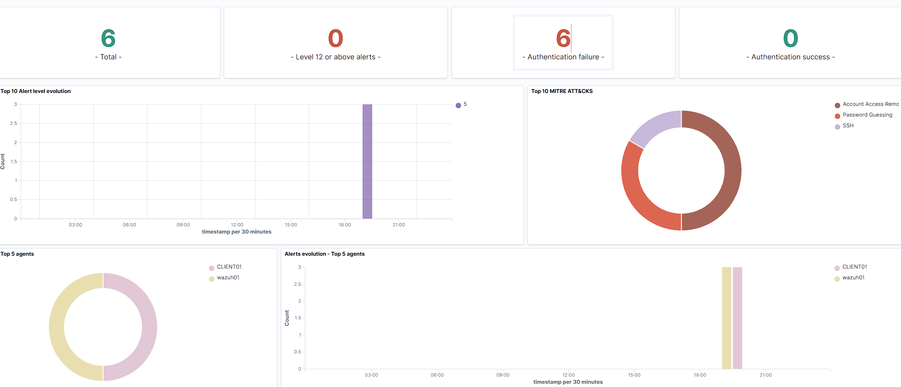

# Failed Logon Detection

## Objective

Validate that failed Windows authentication attempts on CLIENT01 are collected by the Wazuh agent and surfaced in the Wazuh dashboard.

## Environment

- CLIENT01: Windows 11 endpoint
- WAZUH01: Ubuntu Server running Wazuh
- Wazuh agent installed on CLIENT01
- Wazuh Manager, Indexer and Dashboard running on WAZUH01

## Test

CLIENT01 was locked and three intentionally incorrect passwords were entered before signing in successfully.

The purpose of the test was to confirm that Windows authentication failures were being collected from the endpoint and forwarded successfully to Wazuh.

## Result

Wazuh detected the three failed authentication attempts generated on CLIENT01.

The wider Wazuh dashboard also displayed additional authentication-failure alerts from WAZUH01, giving a total of six authentication-failure alerts across the lab at the time of the screenshot.

Relevant alert groups included:

- `authentication_failed`
- `windows`
- `windows_security`

The dashboard also displayed MITRE ATT&CK mappings related to authentication activity, including password guessing and SSH-related activity.

## Evidence

## Analyst Interpretation

Failed authentication events can be caused by normal user error, but repeated failures may also indicate password guessing, account misuse or attempted unauthorised access.

An analyst investigating this type of activity would review:

- affected username
- source endpoint
- source IP address
- timestamps
- number and frequency of failures
- successful logons occurring shortly afterwards
- whether failures originated from the same or multiple systems
- related Windows or SSH authentication events
- other alerts occurring around the same time

The CLIENT01 events in this test were expected because they were intentionally generated as part of the lab.

## Outcome

This test confirmed that:

- CLIENT01 was successfully forwarding Windows Security events to Wazuh
- failed authentication activity was detected and surfaced in the dashboard
- Wazuh could distinguish activity from multiple monitored systems
- authentication events could be reviewed through Threat Hunting and mapped to relevant security categories

This provided a basic end-to-end validation of the lab's endpoint monitoring and SIEM detection pipeline.