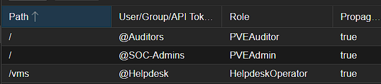
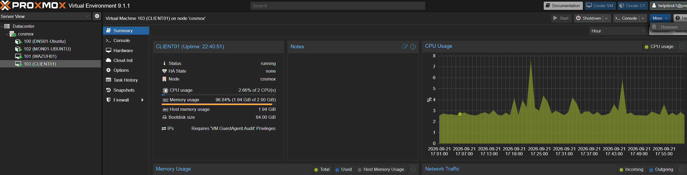
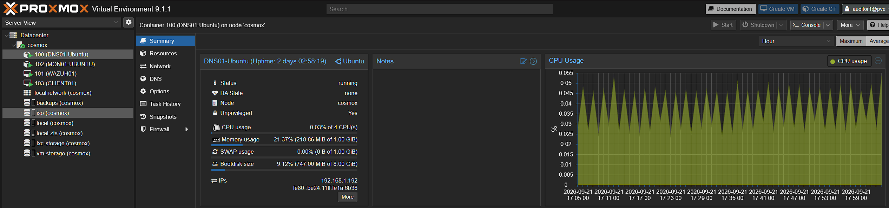
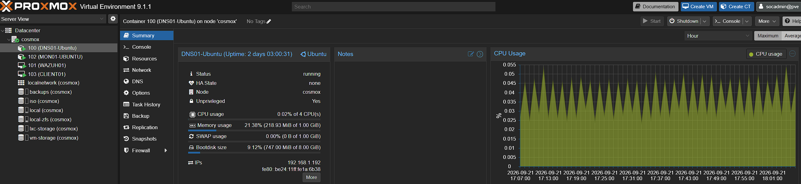

# Proxmox RBAC and Identity Access Control

## Objective

Implement role-based access control in Proxmox to demonstrate least privilege, separation of duties, scoped administrative access, and access validation.

## Roles Created

### SOC Admins

- Group: `SOC-Admins`
- Role: `PVEAdmin`
- Scope: `/`
- Purpose: Elevated infrastructure and security administration.

### Helpdesk

- Group: `Helpdesk`
- Custom Role: `HelpdeskOperator`
- Scope: `/vms`

Permissions include:
- View VM information
- Access VM console
- Start, stop, and reboot VMs

Restrictions include:
- No destructive administrative access
- No permission management
- No host-wide configuration changes

### Auditors

- Group: `Auditors`
- Role: `PVEAuditor`
- Scope: `/`
- Purpose: Read-only access for auditing and review.

## RBAC Configuration

The following configuration shows the group-to-role assignments and their permission scopes.

## Access Validation

### Helpdesk Limited Access

The Helpdesk account can perform routine VM operations but does not have full administrative access.

### Auditor Read-Only Access

The Auditor account can view the environment but cannot perform operational changes such as starting or shutting down systems.

### SOC Admin Privileged Access

The SOC Admin account has elevated access for security and infrastructure administration.

## Security Principles Demonstrated

- Role-Based Access Control (RBAC)
- Principle of Least Privilege
- Separation of Duties
- Permission Scoping
- Privileged Access Management
- Access Validation
- Auditability

## Outcome

This configuration demonstrates how different job functions can be assigned appropriate levels of access without giving every user full administrative privileges.

The Helpdesk role has limited operational access, the Auditor role has read-only visibility, and the SOC Admin role has elevated administrative permissions.

This reduces unnecessary privilege and provides clearer separation between operational, auditing, and administrative responsibilities.

## Limitations

This lab demonstrates the core principles of RBAC, but it is intentionally simplified compared with a production environment.

Current limitations include:

- Local Proxmox accounts are used rather than a central identity provider.
- Access is assigned manually rather than through automated joiner, mover, and leaver processes.
- Privileged access is role-based, but there is no just-in-time or time-limited elevation.
- Access reviews are currently manual.
- The lab does not yet enforce multi-factor authentication for all privileged accounts.
- The number of users and roles is small, so the design has not yet been tested at enterprise scale.

A key benefit of the current design is that it is simple and easy to audit. However, as the environment grows, manual account and permission management would become harder to maintain and could increase the risk of excessive or outdated access.

## Future Improvements

I would like to continue developing the identity and access controls in this lab by:

- Integrating Proxmox with a central identity source such as Active Directory, LDAP, or an external identity provider.
- Implementing MFA for privileged accounts.
- Creating a formal joiner, mover, and leaver process.
- Testing access revocation when a user changes role or leaves the organisation.
- Introducing periodic access reviews and documenting approval decisions.
- Sending authentication and permission-related events into Wazuh for monitoring and investigation.
- Creating alerts for repeated failed logins, unusual privileged access, or permission changes.
- Exploring privileged access management concepts such as just-in-time access and temporary elevation.
- Documenting an access request and approval workflow to demonstrate governance as well as technical controls.